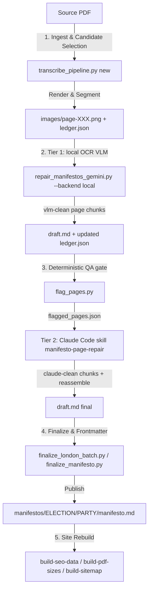

# Transcription & visual repair pipeline (two-tier, no API key)

Converts political party manifesto PDFs into clean, complete, structured Markdown (`manifestos/<electionId>/<partyId>/manifesto.md`).

**Project home:** `tools/transcription-toolkit/` — one-time local model setup: `tools/transcription-toolkit/LOCAL_SETUP.md`

Since 2026-07 the pipeline runs **without any API key**. Vision work is split into two tiers:

- **Tier 1 (bulk, free, unlimited):** a local document-OCR VLM — DeepSeek-OCR (8-bit MLX) served by LM Studio/oMLX on localhost — transcribes every page image straight to Markdown.
- **Gate (deterministic):** `flag_pages.py` checks each model-transcribed page (word coverage vs the PDF text layer, `qa_check.py` artefact scan) and flags failures.
- **Tier 2 (frontier quality, subscription-covered):** a Claude Code session in this repo repairs *only* the flagged pages by reading the page images directly — via the `manifesto-page-repair` skill (`.claude/skills/manifesto-page-repair/SKILL.md`). No API calls.

The old paid paths (`--backend gemini`, `qa_audit_vision.py`) still exist but are optional/legacy.



---

## Phase-by-Phase Process

### Phase 1: Ingestion & Candidate Extraction
Run `python transcribe_pipeline.py new <path-to-pdf>`:
1. Renders high-res page images under `tools/transcription-toolkit/work/<slug>/images/page-XXX.png`.
2. Extracts raw text candidates for each page using multiple engines:
   - `pdfplumber` / `pdftotext` for native digital PDFs.
   - `marker-ocr` / OCR for scanned or image-heavy PDFs.
3. Initializes `ledger.json` to record per-page image paths, text candidates, word counts, and initial candidate selections.

### Phase 2: Tier-1 Local VLM Transcription
Prerequisite: LM Studio serving `mlx-community/DeepSeek-OCR-8bit` on `localhost:1234` (see `LOCAL_SETUP.md`).

Run `python repair_manifestos_gemini.py <path-to-ledger.json>` (filename is legacy; the script is backend-agnostic and defaults to `--backend local --mode ocr`):
- Sends each page image (`page-XXX.png`) alone to the local OCR VLM, which outputs structured Markdown with native reading-order and heading handling.
- Post-processes output (strips code fences, DeepSeek grounding tokens, empty image placeholders).
- Saves cleaned page text to `pages/page-XXX.vlm-clean.txt`, registers `"vlm-clean"` as the selected candidate in `ledger.json`, and reassembles `draft.md`.
- Useful flags: `--model <id>`, `--base-url <url>`, `--pages 0,3,5-9`, `--force`, `--reassemble-only` (rebuild draft.md with no model calls). Legacy paid path: `--backend gemini` (`GEMINI_API_KEY` in `.env`, `--mode repair` uses the draft-repair prompt).

### Phase 3: Deterministic QA Gate + Tier-2 Claude Repair
Run `python flag_pages.py <path-to-ledger.json>`:
- For every model-transcribed page, checks **word coverage** (vlm-clean word count vs best deterministic extraction; default pass band 0.85–1.30) and runs **`qa_check.py --json`** on the page text (encoding junk, heading errors, column-join symptoms, etc.).
- Writes `flagged_pages.json` and marks failing pages `status: "needs-review"` in the ledger. This replaces the paid `qa_audit_vision.py` audit for gating (that script still exists but is optional/legacy).

Then repair flagged pages in a **Claude Code session** (subscription, no key): ask *"Repair the flagged pages in work/<slug>"*. The `manifesto-page-repair` skill has Claude read each flagged page image itself, write `pages/page-XXX.claude-clean.txt` with the same strict rules (linear reading order, heading hierarchy, boilerplate removal, verbatim fidelity), update the ledger, reassemble `draft.md` (`--reassemble-only`), and re-run the gate to confirm.

### Phase 4: Finalization & Frontmatter Generation
Run `python finalize_london_batch.py <batch-number>` or `python finalize_manifesto.py`:
1. Attaches the canonical H1 title (`# {Party/Candidate Display Name} London Mayoral Manifesto {Year}`).
2. Scans body text against `SECTION_KEYWORDS` in `scripts/process_manifestos.py` to auto-detect section taxonomy tags (`housing`, `transport`, `law-and-order`, `environment`, etc.).
3. Generates standard YAML frontmatter (election year, party ID, leader name, political spectrum, victory/outcome status).
4. Copies the finalized file to `manifestos/<electionId>/<partyId>/manifesto.md`.

### Phase 5: Site Rebuild & Indexing
After publishing new or updated `manifesto.md` files, rebuild site data:
```bash
python3 scripts/build-pdf-sizes.py
python3 scripts/build-seo-data.py
python3 scripts/build-latest-additions.py
python3 scripts/build-sitemap.py
python3 scripts/build-fulltext-index.py
python3 scripts/build-manifesto-assets.py
python3 scripts/build-og-images.py --only party
```
- **`build-pdf-sizes.py`**: Updates `data/pdf-sizes.json` with human-readable download sizes.
- **`build-seo-data.py`**: Rebuilds `data/seo.json` and `data/catalog.jsonld` for Schema.org metadata.
- **`build-latest-additions.py`**: Ranks additions by git commit date for the homepage carousel (`data/latest-additions.json`).
- **`build-sitemap.py`**: Re-generates `sitemap.xml`.
- **`build-fulltext-index.py`**: Rebuilds the Full text search index
  (`data/fulltext-index.json` + `data/fulltext-meta.json`). Without this, new
  transcriptions will not appear in Full text mode. Check staleness with
  `python3 scripts/build-fulltext-index.py --check`. Details:
  [fulltext-index](./fulltext-index.md).
- **`build-manifesto-assets.py`**: Rebuilds `data/manifesto-assets.json` so
  text-only editions without a cover show the “Scan not yet archived”
  placeholder. Details: [manifesto-assets](./manifesto-assets.md).
- **`build-og-images.py --only party`**: Regenerates party Open Graph cards (and
  `data/party-holdings.json`) so share-preview election counts stay in sync with
  new holdings. Use a full `python3 scripts/build-og-images.py` when election /
  hub / manifesto cards also need refreshing. Details:
  [og-generator](./og-generator.md).

Bump `?v=` / `ASSETS_VERSION` when JS/CSS change; the full-text index cache-busts
via `fulltext-meta.json` after rebuild.

---

## Batch Automation Scripts

For bulk processing, use the batch scripts under `tools/transcription-toolkit/`:
- `batch_london_manifestos.py <batch>`: Ingests PDFs, extracts candidate text, and outputs review checklist.
- `batch_repair_london.py <batch> [args]`: Runs tier-1 local VLM transcription on every manifesto in the batch; extra args are forwarded to the repair script (e.g. `--model deepseek-ocr-8bit`, `--only-flagged`, `--backend gemini`). Overnight-safe: no API cost.
- After the batch, run `flag_pages.py` per work dir (or ask Claude Code to gate + repair the whole batch with the `manifesto-page-repair` skill).
- `finalize_london_batch.py <batch>`: Attaches frontmatter, canonical H1 titles, tags sections, and copies files to site folders.
